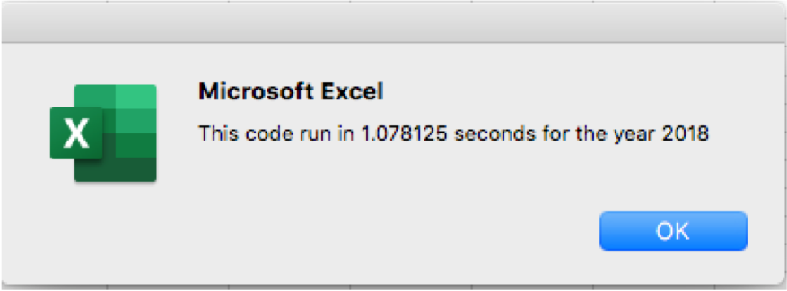

# Green Stocks Analysis Challenge

## Overview of Project

### Project Background
Steve’s parents are interested in green energy. There are many forms of alternative energy to invest in, however they have put all their investments in one stock called DQ without much research. Steve promised to look into the DQ stocks performance and provide guidance on diversifying their funds in other type of green energy stocks. In order to accomplish the task, he has collected additional green energy stocks data in an excel spreadsheet to be analyzed in a timely and efficient way.
### Previous Work and Results
In order to help Steve’s analysis, VBA was used to put together a script to quickly understand DQ stock performance during the years 2017 and 2018 as well as analyzing the performance of other additional green energy stocks. The results of the analysis showed that DQ stocks dropped about 63% in 2018 and only two stocks (ENPH and RUN) increase their return in 2018. For 2017, most stocks increased their return except TERP with a dropped of 7%. (The original script’s name is “yearValueAnalysis_Final”).
### Purpose of Analysis
Steve wants to expand the dataset to include the entire stock market over the last few years and do a little more research for his parents. Due to the fact that he will be working with a bigger dataset, it is a good idea to make the script more efficient as well as making sure it doesn’t take too long with a bigger dataset.

The objective of this work is to refactor the original script, test it with the same data set to collect the same information obtained with the original script and determine whether refactoring makes the script run faster. By improving the script, Steve will be able to expand the dataset and do a little more research for his parents in a timely fashion. 

---
## Results

### Refactored Script Coding
* 1a) Create a ticker Index variable. This variable holds the index of each of the tickers and it is set to start at zero, since we’ll go through each company (ticker) to do the analysis. The tickerIndex variable will be used to access the correct index across the different arrays (tickers, tickerVolumes, tickersStartingPrice and tickerEndingPrice). Tickers array has been created already, the other 3 arrays are created in 1b.

    	Dim tickerIndex As Integer 
		tickerIndex = 0

* 1b) Created three output arrays. The 3 arrays will have 12 elements which are correspondent to the 12 tickers/companies that each element will be filled with the data of volumes, starting price and ending price.

		Dim tickerVolumes(12) As Long
		Dim tickerStartingPrice(12) As Single
		Dim tickerEndingPrice(12) As Single

* 2a) Created a for loop to initialize the tickerVolumes to zero. “Count” is just another index in this loop to initialize the volumes to zero every time a new ticker/company analysis is complete after going through all the rows for that particular ticker performed in the following loop.
    	
		For Count = 0 To 11
        		tickerVolumes(Count) = 0
            	Next Count

* 2b) Created a for loop to go over all the rows in the spreadsheet. This is the loop that will go over each row to get the data for each ticker.

		For i = 2 To RowCount

* 3a) Increase volume for current ticker. This will add up the volumes from the volumes column to the current item of the tickerVolume array indicated by the tickertIndex.

		tickerVolumes(tickerIndex) = tickerVolumes(tickerIndex) + Cells(i, 8).Value

* 3b) Created an if statement to check if the current row is the first row with the selected ticker then assign the value of the price to the tickerStartingPrice.
 
       	If Cells(i -1, 1).Value <> tickers(tickerIndex) Then
		tickerStartingPrice(tickerIndex) = Cells(i, 6).Value
         End If

* 3c) Created an if statement to check if the current row is the last row with the selected ticker then assign the value of the price to the tickerEndingPrice.
 
         If Cells(i + 1, 1).Value <> ticker(tickerIndex)  Then
		tickerEndingPrice(tickerIndex) = Cells(i, 6).Value

* 3d) Increase the tickerIndex. Since this is a function of knowing of the if statement above in terms that if the next row doesn’t match the current row then increase the tickerIndex to go to the next ticker/company.

		tickerIndex = tickerIndex + 1
           End If
        	
	Next i

* 4) Loop through your arrays to output the Ticker, Total Daily Volume, and Return.
    
        	For j = 0 To 11
    
       		Worksheets("All Stocks Analysis").Activate
       
       		Cells(4 + j, 1).Value = tickers(j)
	
			Cells(4 + j, 2).Value = tickerVolumes(j)
	
			Cells(4 + j, 3).Value = (tickerEndingPrice(j) / tickerStartingPrice(j)) - 1
  
    		Next j

### Stock Performance and Execution Times
The results of the analysis showed that DQ stocks dropped about 63% in 2018 and only two stocks (ENPH and RUN) increased their return in 2018. For 2017, most stocks increased their return except TERP with a dropped of 7%. See tables below

All Stocks 2017 Results

All Stocks 2018 Results

In terms running time, there was an improvement in the script execution time from the original script to the refactored script. Comparing the execution time for year 2018, the improvement was about 88% running time with the refactoring script. See below the pop up messages for the original and refactored scripts

Original Script Execution Time

Refactored Script Execution Time

---
## Summary

* In general the advantages of refactoring is less time taken by the programmer to build a script compared to building it from scratch. It takes fewer steps, uses less memory and improves the logic of the code to make it easier for future users. Some disadvantages could be if the refactoring of the code is done on a script without enough documentation this could be time consuming.
* On the current Stock Analysis refactoring code, there was an improvement in execution time making easier for the user to incorporate more data for future analysis.

---
